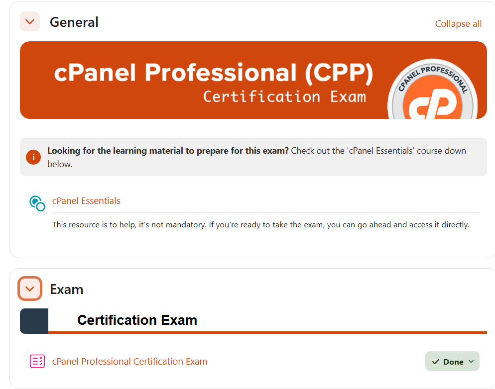

# 🛡️ cPanel & WHM Professional Exam — Study Repository

This repository contains **notes, hands-on labs, practical scenarios, extras, and a certificate image** to prepare for the *cPanel & WHM Professional Exam*. The materials focus on administering cPanel/WHM, DNS & email management, Apache/PHP/MySQL, backups, security hardening, and troubleshooting.

---

## 📚 Notes
- 📄 [`notes/01-introduction.md`](./notes/01-introduction.md) — Exam overview & environment setup  
- 📄 [`notes/02-server-management.md`](./notes/02-server-management.md) — WHM, accounts, packages, DNS zones  
- 📄 [`notes/03-email-management.md`](./notes/03-email-management.md) — Exim, SpamAssassin, DKIM/SPF, mail routing  
- 📄 [`notes/04-security-basics.md`](./notes/04-security-basics.md) — AutoSSL, cPHulk, firewall basics, 2FA  
- 📄 [`notes/05-apache-php-mysql.md`](./notes/05-apache-php-mysql.md) — EasyApache 4, MultiPHP, MySQL/MariaDB administration  
- 📄 [`notes/06-backup-recovery.md`](./notes/06-backup-recovery.md) — Backup configuration & restore workflows  
- 📄 [`notes/07-troubleshooting.md`](./notes/07-troubleshooting.md) — Log locations, CLI tools, common fixes  
- 📄 [`notes/08-practice-questions.md`](./notes/08-practice-questions.md) — Sample Q&A & quick review

---

## 🧪 Labs
Step-by-step guided labs to build practical administration skills. Always use isolated VMs and snapshots.
- 💻 [`labs/01-basic-setup.md`](./labs/01-basic-setup.md) — Install cPanel/WHM & initial configuration  
- ⚙️ [`labs/02-apache-php.md`](./labs/02-apache-php.md) — EasyApache 4 & PHP handlers (DSO, FPM, CGI)  
- 🌐 [`labs/03-dns-zones.md`](./labs/03-dns-zones.md) — Managing DNS records, propagation checks  
- ✉️ [`labs/04-email-services.md`](./labs/04-email-services.md) — Mail flow, Exim logs, troubleshooting delivery  
- 🔒 [`labs/05-security.md`](./labs/05-security.md) — AutoSSL, cPHulk, firewall (CSF) basics  
- 🔧 [`labs/06-troubleshooting.md`](./labs/06-troubleshooting.md) — Service restarts, error triage, restores

---

## 🧩 Hands-On (Scenario Practicals)
Applied scenarios that simulate real hosting incidents and security contexts:
- 🕸️ [`hands-on/web-exploitation.md`](./hands-on/web-exploitation.md) — Web app issues in hosting context (XSS/SQLi analysis, safe testing)  
- 🌐 [`hands-on/network-attacks.md`](./hands-on/network-attacks.md) — Network-level impacts on web hosting (packet capture, DoS simulation)  
- 🔐 [`hands-on/crypto.md`](./hands-on/crypto.md) — TLS/certificate management and password storage practices  
- 🕵️ [`hands-on/forensics.md`](./hands-on/forensics.md) — Log collection, timeline building, artifact analysis  
- ⚙️ [`hands-on/privilege-escalation.md`](./hands-on/privilege-escalation.md) — Permission audits, sudoers review, secret handling

---

## 📎 Extras
Quick reference aids and study boosters:
- 🧠 [`extras/exam-tips.md`](./extras/exam-tips.md) — Study & test-taking strategies  
- ❓ [`extras/faq.md`](./extras/faq.md) — Frequently asked questions for candidates  
- 🔗 [`extras/resources.md`](./extras/resources.md) — Official docs, community resources, video tutorials

---

## 📖 Docs
Core documentation for planning and revision:
- 📘 [`docs/index.md`](./docs/index.md) — Overview & objectives  
- 📘 [`docs/syllabus.md`](./docs/syllabus.md) — Exam syllabus & topic breakdown  
- 📘 [`docs/roadmap.md`](./docs/roadmap.md) — Suggested study timeline (5-week plan)  
- 📘 [`docs/references.md`](./docs/references.md) — Useful links & official guides  
- 📘 [`docs/glossary.md`](./docs/glossary.md) — Important terms & definitions

---

## 📸 Screenshots
| Step | Screenshot |
|---|---|
| Course overview / setup |  |

---

## 📜 Certificate
🎓 `cert/Nguyen-Vu_Thanh-Danh_cPanel-Professional-Certification-Exam.png`  
(Stored here as proof of completion and for portfolio use.)

---

## ▶️ Quickstart
1. Read `docs/index.md` and `docs/syllabus.md` to align study scope.  
2. Follow `labs/01-basic-setup.md` to create a snapshot-able, isolated test VM.  
3. Work through `notes/` modules, then validate skills with `labs/` and `hands-on/` exercises.  
4. Use `extras/exam-tips.md` for targeted revision before the exam.

---

## ⚖️ Safety & Ethics
- Always use isolated lab environments for practical exercises.  
- Do not test on production systems or third-party infrastructure.  
- Respect privacy and legal boundaries — these materials are for learning and defensive purposes.

---

## ✍️ Author
**Thành Danh** – Red Team Learner & Security Researcher  

- GitHub: [@ngvuthdanhh](https://github.com/ngvuthdanhh)  
- Email: ngvu.thdanh@gmail.com  

---

## 📄 License
This project is licensed under the terms of the **MIT License**. See [LICENSE](./LICENSE) for full details.  
© 2025 ngvuthdanhh. All rights reserved.  
